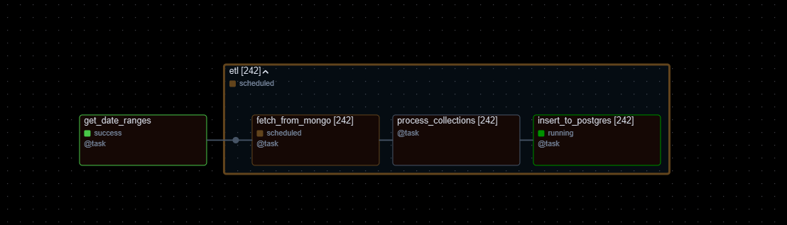

# Pythology

## Python monorepo

Currently all python projects (pythos) are set to use `pip-tools`. 

General use is follows:
```
cd pythos/<project>
source .env
/usr/bin/python3.11 -m venv venv_<project>
source <project>/bin/activate
python -m pip install pip-tools
pip-sync
```

### Adding dependencies

All projects pin dependencies manually through a `pyproject.toml`.

The dependencies can then be synced to the requirements file via `pip-compile`
```pip-compile --output-file=requirements.txt pyproject.toml```

To synchronize virtual environment with any updated requirements, run 
```pip-sync```

### Docker Setup

Currently only showing demo data:
```
echo -e "AIRFLOW_UID=$(id -u)" > .env

docker compose up airflow-init
docker compose up
```

## augur: Django REST API

General purpose aerospace REST API. Has public API to wrap other mono repo services. 

## dreamflow: Apache Airflow Data Orchestration

Runs data pipelines for aerospace services




## lore: Postgres+PostGIS

Extended to use some custom sql commands on docker startup


## lib

General purpose python functions